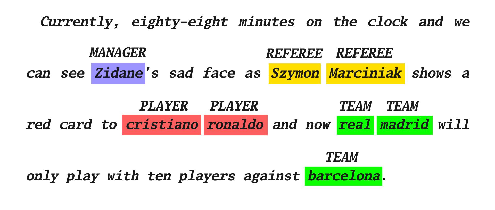

<!-- PROJECT LOGO -->
<br />
<p align="center">

  <h3 align="center">Soccer Named Entity Recognition</h3>

  <p align="center">
    Natural Language Processing
    <br />
  </p>
  </br>
  <p align="center">
    
  </p>
</p>

<!-- TABLE OF CONTENTS -->
<details open="open">
  <summary><h2 style="display: inline-block">Table of Contents</h2></summary>
  <ol>
    <li><a href="#about">About</a></li>
    <li><a href="#testing">Testing</a></li>
    <li><a href="#contribution">Contribution</a></li>
    <li><a href="#license">License</a></li>
    <li><a href="#contact">Contact</a></li>
  </ol>
</details>

<!-- ABOUT THE PROJECT -->

## About

<div style="text-align: justify">
  
**Motivation**: Academic project for Natural Language Processing, M2AI. We pretend to perform speech to text on sports broadcasting channels (soccer), and detect the names of the players, the name of the referee, name of the technicians, name of the teams, and name of the stadium. 

**Implementation**: All the code was implemented in python and it can be divided in four parts: **(1)** There's a web scrapper in utils/trans_scraper.py that is responsible to find soccer matches on youtube and extract the transcripts/commentaries of the videos to a .csv file. **(2)** There's also another web scrapper in utils/soccer_scraper.py that is responsible to scrape all the soccer data usefull for the labeling task. The data was scraped from sofifa.com and wikipedia.com. **(3)** The code in utils/process_data.py is responsible to process and label the data from the .csv file (soccer matches transcripts) according to the data scraped from sofifa.com and wikipedia.com. **(4)** This last script located at utils/model_pipeline.py is responsible to initialize the model, train it, and test it using the test dataset or manually provided data.

There's also a all in one script main.py and jupyter notebook version for debug purposes.

**_Tested with_** a long short-term memory (LSTM).

**_Built With_** Python3.6, Selenium and Trax.

<!-- SIMULATION -->

## Testing

```python
# install the requirements
pip install -r requirements.txt

# run the main.py script
python main.py [args]
```

```cmd
usage: main.py [-h] [--run-all] [--soccer-transcripts] [--soccer-data] [--process-data] [--train-model]

optional arguments:
  -h, --help            show this help message and exit
  --run-all             run all steps
  --soccer-transcripts  run transcripts scraper
  --soccer-data         run soccer data scraper
  --process-data        run dataset processing step
  --train-model         create and train model step
```

## Contribution

Feel free to submit a pull request with your improvements.

## License

Distributed under the MIT License. See `LICENSE` for more information.

<!-- CONTACT -->

## Contact

Fábio Oliveira - [LinkedIn](https://www.linkedin.com/in/fabioo29/) - fabiodiogo29@gmail.com

Project Link: [https://github.com/fabioo29/pt-house-price-predict](https://github.com/fabioo29/soccer-entity-recognition)  
Project built as a Msc. Applied Artificial Intelligence Student.